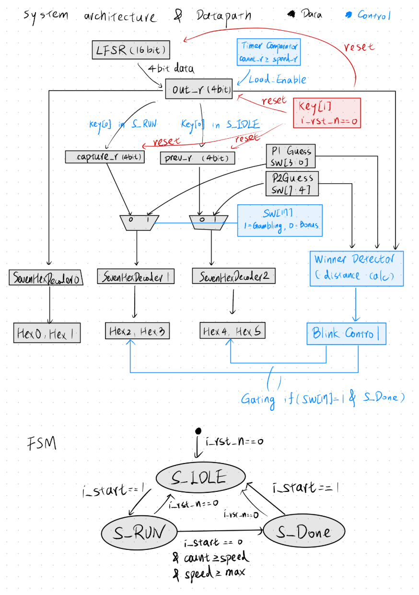

# 實驗一：隨機數字猜測遊戲詳細報告 (Lab 1 Final Report)

本報告針對實驗一「隨機數字猜測遊戲」進行詳細分析，包含系統架構、資料路徑、硬體調度流程以及實際操作說明。

---

## 1. 檔案結構 (File Structure)

專案的程式碼結構如下圖所示：

- **`src/`**
  - **`Top.sv`**: 遊戲核心邏輯模組。包含 LFSR（線性回饋移位暫存器）亂數產生器、時鐘分頻（控制亂數跳動速度）、以及負責控制遊戲流程的 FSM（有限狀態機）。
  - **`DE2_115/`**
    - **`DE2_115.sv`**: 硬體頂層模組。將開發板的 I/O（如 Switch, Key, 7-Segment Display）連接至內部的子模組。
    - **`Debounce.sv`**: 按鍵防彈跳模組。確保按下按鍵時訊號穩定，避免因機械抖動觸發多次。
    - **`SevenHexDecoder.sv`**: 7 段顯示器解碼模組。將 4-bit 的二進位數值轉換為七段顯示器控制訊號。

---

## 2. 系統架構與資料路徑 (System Architecture & Data Path)

系統的資料路徑負責處理從輸入到顯示的完整流程。核心特點在於 `out_r` 暫存器的精確更新控制，以及由 `SW[17]` 決定的顯示模式切換。

### **資料路徑文字說明**
*   **輸入與擷取**：
    *   **LFSR (16-bit)**：系統的隨機源，每週期生成新的偽隨機數。
    *   **out_r (4-bit)**：當前的隨機數字暫存器。它並非隨時跟隨 LFSR，而是由 FSM 產生的 **Load Enable (致能)** 訊號控制。當計數器 `count_r` 到達當前速度門檻 `speed_r` 時，才會載入 LFSR 的低 4 位元。
    *   **capture_r & prev_r**：這兩個暫存器負責「保存」資料。`capture_r` 用於中途擷取，`prev_r` 用於記錄前次實驗結果。
*   **模式切換 (SW[17])**：
    *   在頂層模組中，我們使用 **多工器 (MUX)** 根據 `SW[17]` 的電位決定 `HEX2~5` 的資料來源。
    *   所有資料在進入 HEX 之前，都會經過 `SevenHexDecoder` 將 4-bit 二進位轉為 7 段編碼。
*   **判定邏輯**：
    *   `Random Value` (out_r) 會與兩個玩家的猜測值進行減法運算，取得絕對距離 (`Distance`)，此距離進而控制 `S_DONE` 狀態下的閃爍致能訊號。

---

## 3. 硬體調度 (Hardware Scheduling - FSM)

系統透過一個三狀態的有限狀態機 (FSM) 來精確管理遊戲流程與資料擷取時機。

### **狀態轉換與條件說明**
1.  **S_IDLE (閒置狀態)**：
    *   **待命**：當啟動按鈕 `i_start` (KEY[0]) 為 0 時，維持在此狀態，持續讀取開關輸入。
    *   **啟動**：偵測到 `i_start == 1` 時，執行：`prev_w = out_r` (備份前次結果)、重置速度、跳轉至 **S_RUN**。
2.  **S_RUN (運轉狀態)**：
    *   **計數偵測**：若 `count_r < speed_r`，維持在目前數字並繼續計數。
    *   **更新跳動**：若 `count_r >= speed_r` 且速度未達上限，更新 `out_r` 並增加 `speed_r` 的延遲量 (實現減速效果)，繼續保持在 **S_RUN**。
    *   **中途擷取 (Bonus)**：若在 RUN 期間按下 `i_start == 1`，執行：`capture_w = out_r` (抓取當下顯示值)、重置速度為最快，繼續保持在 **S_RUN** 重新開始減速流程。
    *   **停止條件**：當 `speed_r >= SPEED_MAX` 時，跳轉至 **S_DONE**。
3.  **S_DONE (完成狀態)**：
    *   **結果鎖定**：鎖定最後的隨機數，計算勝負並視模式決定是否閃爍。
    *   **回到初始**：再次按下 `i_start == 1` 後，重置系統狀態回到 **S_IDLE**。
*   **全域重置 (Global Reset)**：無論在任何狀態，只要 `i_rst_n` (KEY[1]) 被按下，系統會強制跳回 **S_IDLE** 並初始化所有暫存器。

---

## 4. 模式操作規則

根據 `SW[17]` 的設定，系統展現出兩種截然不同的操作體驗：

### **模式一：雙人賭博對戰 (SW[17] = 1)**
*   **顯示內容**：`HEX0-1` 顯示跳動的亂數，`HEX2-3` 與 `HEX4-5` 分別顯示玩家 1 與玩家 2 的目前猜測值。
*   **操作流**：按下 `KEY[0]` 開始遊戲 -> 數字開始變慢 -> 停止後，較接近者對應的猜測值 HEX 會開始閃爍。
*   **特色**：強調即時互動與勝負判定。

### **模式二：一般加分模式 (SW[17] = 0)**
*   **顯示內容**：`HEX2-3` 顯示你在上一次 **S_RUN** 期間透過按鍵抓取的數字 (`capture_r`)。`HEX4-5` 顯示上一次實驗結束時的最終數字 (`prev_r`)。
*   **操作流**：可以在數字旋轉時按下 `KEY[0]` 來「抓取」你想要的數字到 HEX2-3，或者在遊戲重新開始後，到此模式查看上次的結果。
*   **特色**：用於結果回溯與特定時間點的資料存儲，不具備閃爍判定功能。

---

## 5. Fitter Summary 截圖

---

## 6. Timing Analyzer 截圖

---

## 7. 遇到的問題與解決辦法，心得與建議

### 遇到的問題與解決辦法
*   **問題 1**：在處理減速邏輯時，對 50MHz 時脈的速度感掌握不足。
    *   **解決辦法**：透過參數化方式調整 `SPEED_INIT` 與 `SPEED_STEP`。為確保計數器不會溢位，使用了 26-bit 的 `count_r` 與 `speed_r` 暫存器，順利實現滑順的減速停下效果。
*   **問題 2**：如何讓同一個按鈕在不同狀態下有不同功能。
    *   **解決辦法**：在 FSM 的 `always_comb` 區塊中，針對不同的 `state_r` 給予獨立的 `i_start` (KEY[0]) 觸發邏輯。例如在 `S_IDLE` 時是「開始並記錄 prev」，在 `S_RUN` 時是「擷取並重設速度」。

### 心得與建議
透過此次實驗，我們學會了如何將複雜的遊戲流程拆解為明確的 FSM 狀態。特別是加分功能的實作，讓我們更深入理解了硬體暫存器如何透過「分時復用」同一個輸入按鈕，來達成不同的控制目標。
