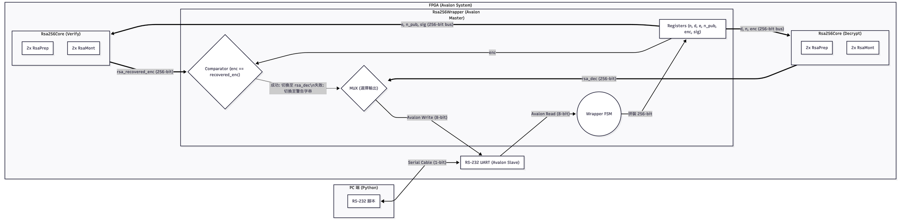
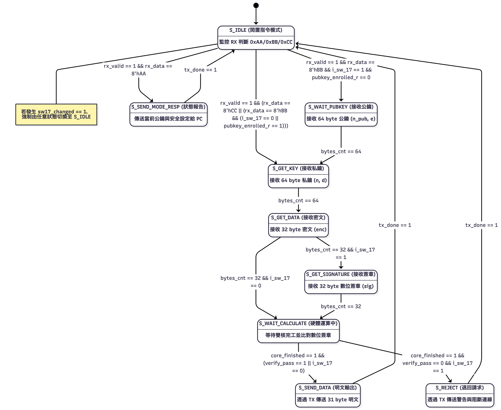
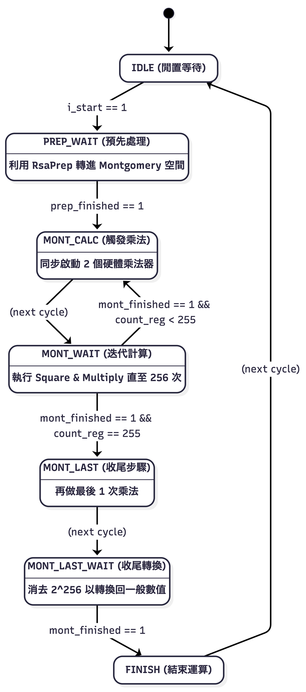

# DCLab Lab2 Report

**組別：Group 11**

---

## 1. File Structure

本次實驗專案的目錄結構及各檔案主要負責之功能如下：

* `src/`
    * `DE2_115/`：存放與開發板 FPGA 相關的腳位配置與周邊設定檔。
    * `pc_python/`：包含電腦端的 Python 腳本，負責與 FPGA 透過自訂的指令協定進行 RS-232 傳輸，涵蓋完整的公私鑰交換與簽章傳輸。
    * `tb_verilog/`：包含 RSA Core 與 Wrapper 的 Verilog 測試檔 (Testbench)，用於模擬雙核心與指令系統是否正常運作。
    * `Rsa256Core.sv`：包含 `Rsa256Core`、`RsaPrep` 與 `RsaMont`，為 RSA 256 加解密的心臟模組，負責利用 Montgomery Algorithm 計算 $a^d \pmod n$。
    * `Rsa256Wrapper.sv`：Avalon Master 控制器，負責管理自訂的串列傳輸通訊協定，並包裝了**兩具 Rsa256Core** 以支援硬體同步解密與認證數位簽章（Bonus 實作）。
* `rsa_qsys/`：Qsys 系統產生的相關設定與硬體描述檔。
* `README.md`：本次 Lab 的環境設置說明與要求細節。

---

## 2. System Architecture (包含 Bonus：數位簽章與指令集協定)

本次系統架構不但符合 Lab 基礎要求，另外實作了安全驗證機制與免硬體重啟的串列指令協定（Bonus）。
系統架構主要由 PC 端與 FPGA 控制端組成。當 FPGA 開關 `i_sw_17` 打開時，系統將進入進階的安全簽章模式。在 FPGA 內部，`Rsa256Wrapper` 同時掌控了兩顆 `Rsa256Core`：一顆負責 Ciphertext 解密 (`rsa256_core_decrypt`)，另一顆負責簽章驗證 (`rsa256_core_verify`)。

### Data Path
整個資料的流向 (Data Path) 流程如下：
1. **PC 指令解析 $\to$ Wrapper**：PC 端不再盲目丟送封包，而是會先送出 `8'hAA` (Query)、`8'hBB` (Enroll)、`8'hCC` (Next) 等前綴指令，`Rsa256Wrapper` 解析後進行狀態收發跳轉。
2. **PC $\to$ RS-232 (RX)**：電腦端將 64 bytes 的公鑰 (`n_pub`, `e`)、64 bytes 的私鑰 (`n`, `d`)、32 bytes 的密文 (`enc`) 以及 32 bytes 的數位簽章 (`sig`) 依序透過協定傳入 FPGA。
3. **Wrapper $\to$ 雙核心**：Wrapper 集齊上述資料後，同時將資料分送給兩顆 RSA Core，並拉起 `i_start` 觸發平行計算。
4. **Core Internal Path**：兩顆 `Rsa256Core` 分別執行 Montgomery 演算法。
5. **雙核心 $\to$ Wrapper 驗證**：運算完成時，Wrapper 會比對驗證核心算出的 `rsa_recovered_enc` 是否吻合收到的 `enc`。
6. **Wrapper $\to$ RS-232 (TX)**：
   * **若驗證通過（或未啟用 SW17）**：Wrapper 會把解密核心的結果取出，由高至低將 31 bytes 的明文寫入 TX 傳回 PC。
   * **若驗證失敗（數位簽章不符）**：Data Path 會被阻斷，Wrapper 改為強制將字串 `"Nice try Diddy... "` 寫入 TX 並回傳，拒絕送出明文。
7. **無須重置機制**：送完資料後，Wrapper 自動退回 `S_IDLE` 等待下一組命令（Bonus 要求）。

---

## 3. Hardware Scheduling (FSM or Algorithm Workflow)

硬體排程分為 `Rsa256Wrapper` 的傳輸與安全控制，以及 `Rsa256Core` 的計算排程兩個部分。

### `Rsa256Wrapper` FSM 排程 (整合 Bonus Command)
狀態機擴展為 9 個狀態來管理複雜的封包生命週期：
* **`Global Soft Reset`**：不論當前狀態為何，只要指撥開關 `SW17` 狀態發生改變（`sw_17_r ^ i_sw_17`），系統會立即產生 Soft Reset，強制清除所有暫存與公鑰註冊狀態，並將 FSM 切換回 `S_IDLE`。
* **`S_IDLE`**：初始閒置狀態，監聽第一個 Byte 來決定路線。
  * 收到 `0xAA` $\to$ 跳轉 `S_SEND_MODE_RESP`（回報模式與公鑰註冊狀態）。
  * 收到 `0xBB` $\to$ 判斷若 `i_sw_17 == 1` 且尚未註冊過公鑰 (`!pubkey_enrolled_r`)，則跳轉 `S_WAIT_PUBKEY` 進行完整的 session 與公鑰替換；反之則直接跳轉 `S_GET_KEY`。
  * 收到 `0xCC` $\to$ 跳轉 `S_GET_KEY` 直接沿用舊鑰匙繼續解密。
* **`S_WAIT_PUBKEY`**：接收 64 bytes 資料以組合驗證用的 `n_pub` 與 `e`。
* **`S_GET_KEY`**：接收 64 bytes 資料以組合解密用的 `n` 與 `d`。
* **`S_GET_DATA`**：接收 32 bytes 的 Ciphertext (`enc`)。
* **`S_GET_SIGNATURE`**：(僅啟用 `sw_17` 會觸發) 接收 32 bytes 的數位簽章 (`sig`)。
* **`S_WAIT_CALCULATE`**：關閉 Avalon 讀取，等待解密與驗證兩組核心發出 `finished`。完成後比對內部暫存器。若簽章通過則進入 `S_SEND_DATA`，若失敗則進入 `S_REJECT`。
* **`S_SEND_DATA` / `S_REJECT` / `S_SEND_MODE_RESP`**：這三個狀態負責輪詢 `TX_OK`，將明文、警告字串或狀態回應封裝後送出，並於結束後皆自動跳轉回 `S_IDLE` 以接受新指令，徹底消除了每次都要硬體 Reset 的繁瑣。

### `Rsa256Core` Algorithm Workflow (FSM)
核心採取 Montgomery 演算法進行運算，平行雙核心階採用相同的內部狀態：
* **`IDLE`**：等待 `i_start` 觸發。
* **`PREP_WAIT`**：啟動 `RsaPrep` 模組，將基底 $a$ 與 $1$ 分別乘上 $2^{256} \pmod n$。完成後 $t \leftarrow a'$, $m \leftarrow 1'$，進入計算態。
* **`MONT_CALC`**：平行觸發兩組 Montgomery Multiplier (`mont1`: $m \times t$，`mont2`: $t \times t$)。
* **`MONT_WAIT`**：當兩組皆結束時，檢查 `i_d[count_reg]` 決定是否更新 $m \times t$。`t_reg` 自動更新為 $t^2$。持續 256 次迭代。
* **`MONT_LAST` & `MONT_LAST_WAIT`**：進行最後一次乘法 $m \times 1$，消除加入的 $2^{256}$ 轉換因子。
* **`FINISH`**：運算完畢。

---

## 4. Fitter Summary 截圖

*(Quartus 產生之 Fitter Summary 截圖，以展現 ALMs, Registers 的資源消耗，特別是雙核心帶來的變化)*

---

## 5. Timing Analyzer 截圖

*(Quartus Timing Analyzer 關於 Setup Time (WNS), Hold Time 等時序分析截圖)*

---

## 6. 遇到的問題與解決辦法，心得與建議

@陳致堯 您要寫嗎

*(備註：可參考以下開發歷程作為素材)*
* **遇到的問題：實作 Bonus 免重設協定時衍生的軟硬體不同步**
  * **解決辦法：** 一開始把狀態機從純粹的巡迴改裝成會聽 `IDLE` 第一個 Byte (0xAA, 0xBB, 0xCC) 時，發生了 Python 腳本塞資料太快，導致硬體還沒切好模式就漏接後續 32 bytes 的情況。把 Wrapper 發送端與接收端的應答徹底拆分，並在狀態中加入了 `S_SEND_MODE_RESP` 強制要求 Python 端收到硬體 `ACK` 回應之後，才能把 Payload 串流傾倒下來，成功解決同步問題，也讓「數位簽章雙核驗證」跑得非常流暢。
